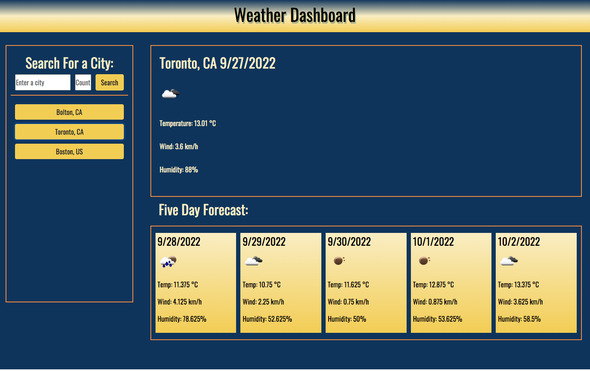

# Weather-Application

## Description

Creating this project I was motivated to make a user-friendly application for travelers abroad to be able to search the weather for almost any city in the world. This is why I built this weather application, so that a user can pull it up at any point and simply type in the city and respective country, and be able to see weather data for the current day as well as a 5 day forecast for the week ahead. This solves the problem for people who are looking for a quick, effective way to find the current and, future weather conditions. It can also help travelers who are looking to head to another city and want to know the weather conditions there. After creating this project I have learned quite a bit about using server-side API's to retrieve data and how to manipulate the data for your needs. It has taught me a lot about parsing data and only using what's important and how to convert that data into something beautiful on my page. 

## Features

* You can search for any city in a selected country and the weather data will be retrieved

* You will be presented with the current weather conditions + a five-day forecast

* Any cities searched will be saved in history and can be pulled up again with the click of the mouse

* Any invalid cities or countries will give an error message and prompt the user to try again

* Country listings input section has an autocomplete feature to help users find their country code

## Usage

The way this application is to be used is to input a city and the respective country code. The application will make a request with an API call and in turn, send back the weather data for that city entered. It is done correctly when data is displayed in the content section otherwise, invalid input will return error messages. Whatever cities you have searched will be stored and you can click on the generated buttons to view that city's weather again.

## Demo

This is the look of my Weather application

## Wire Frame

This is the wire frame design

## Deployed Application

Take a look at my deployed application!

https://keysbhag.github.io/Weather-Application/

## Credits

Main Creator of this project: Keyshawn Bhagwandin https://github.com/keysbhag/Weather-Application

Server Side API's:

* For weather retrieval: https://openweathermap.org/api

* For autocomplete country codes: https://datahub.io/core/country-list#data-cli

Third Party API's: 

Autocomplete function: https://jqueryui.com/autocomplete/#default

Some Styling: https://getbootstrap.com/

## License

N/A

---
© 2022 Keysbhag. Confidential and Proprietary. All Rights Reserved.

